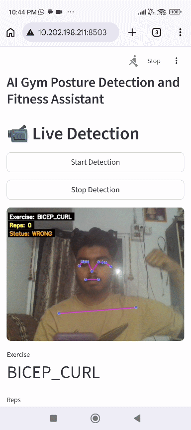
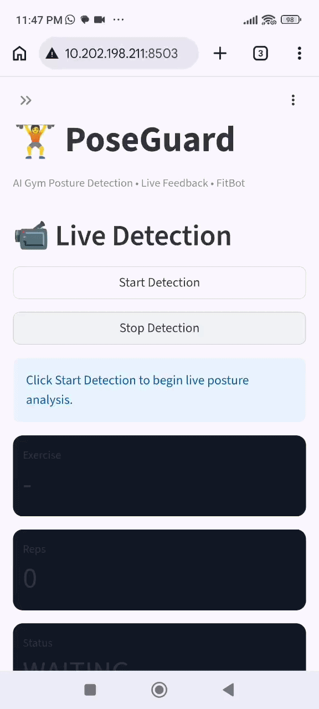
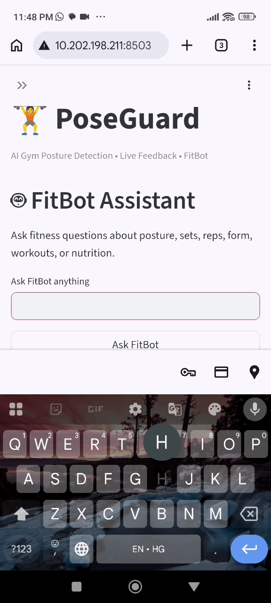
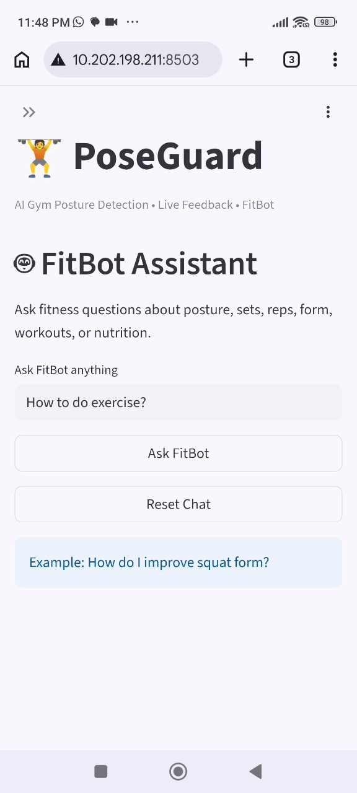

<!-- Animated Header -->
<h1 align="center">🏋️‍♂️ PoseGuard — AI Gym Posture Detection System</h1>#




---

> Real-time AI + ML gym posture detection using MediaPipe and Random Forest. Detects 4 exercises with live audio feedback and an AI fitness chatbot.

> 📱 Mobile demo supported via Streamlit dashboard (open on phone via local network)

---

## Features

- **Auto Exercise Detection** — automatically detects squat, bicep curl, plank, lunge from body angles
- **Real-time Posture Feedback** — classifies posture as correct or wrong using ML
- **Audio Feedback** — speaks corrections aloud when posture is wrong
- **FitBot AI Chatbot** — ask any workout question powered by Groq AI
- **86%+ Accuracy** — trained on real dataset of 100,000+ samples

---

## 🎥 Live Demo

### 📊 Dashboard Overview


---

### 🤖 FitBot Chatbot


---

### 📹 Posture Detection (Webcam)


---

### ℹ️ About Section


---

## Tech Stack

| Layer | Technology |
|-------|-----------|
| Body Detection | MediaPipe BlazePose |
| ML Model | Random Forest Classifier |
| Computer Vision | OpenCV |
| Audio | pyttsx3 |
| AI Chatbot | Groq API (LLaMA3) |
| Language | Python 3.11 |

---

## Exercises Supported

| Exercise | Detection Method |
|----------|----------------|
| Squat | Knee + hip angle from real image dataset |
| Bicep Curl | Elbow angle from CSV landmark data |
| Plank | Hip + shoulder alignment from CSV data |
| Lunge | Knee + hip angle from CSV landmark data |

---

## Project Structure

```
PoseGuard/
├── Dataset/
├── models/
│ └── poseguard_model.pkl
├── utils/
│ ├── pose_detector.py
│ ├── exercise_classifier.py
│ └── audio_feedback.py
├── screenshots/
│ ├── dashboard.gif
│ ├── chatbot.gif
│ ├── webcam.gif
│ └── about.gif
├── main.py
├── app.py
├── chatbot.py
├── train_model.py
├── requirements.txt
└── README.md
```

---

## Installation

**1. Clone the repository:**
```bash
git clone https://github.com/mayankkhadse/PoseGuard.git
cd PoseGuard
```

**2. Install dependencies:**
```bash
pip install opencv-python mediapipe==0.10.14 numpy scikit-learn pandas pyttsx3 groq
```
**3. Setup Groq API Key (Environment Variable):**
```bash
# Windows PowerShell
setx GROQ_API_KEY "your_api_key_here"

**4. Train the model:**
```bash
py -3.11 train_model.py
```

**5. Run PoseGuard:**
```bash
py -3.11 main.py
```

---

## Controls

| Key | Action |
|-----|--------|
| A | Toggle auto / manual mode |
| 1 | Squat mode |
| 2 | Bicep curl mode |
| 3 | Plank mode |
| 4 | Lunge mode |
| C | Open / close FitBot chatbot |
| Q | Quit |

---

## ML Model Performance

| Metric | Score |
|--------|-------|
| Test Accuracy | 86% |
| Macro Avg F1 | 89% |
| Training Samples | 100,000+ |
| Exercises | 4 |
| Algorithm | Random Forest (200 trees) |

---

## IEEE Paper

This project is documented as an IEEE format research paper:
`IEEE_Paper_Mayank_Khadse.docx`

---

## Author

**Mayank Khadse**
B-Tech Electronics & Telecommunication Engineering
Suryodaya College of Engineering and Technology (RTMNU), Nagpur

[](https://linkedin.com/in/mayank-khadse)
[](https://github.com/mayankkhadse)
